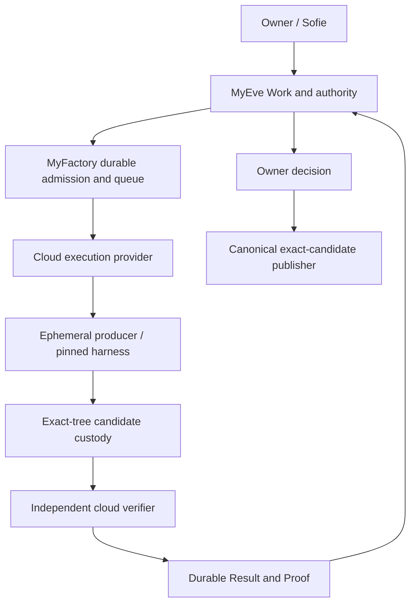

# Cloud execution: laptop-independent MyFactory

Status: **APPROVED dedicated staging architecture; local provider seam implemented. Cloud NOT_READY.**
Date: 2026-10-02 UTC. Integration owner: this cloud-execution workstream. Integration target: canonical `main` after review and qualification. Feature branch: `codex/cloud-execution`.

## Source authority

Fetched GitHub `origin/main` before implementation:

| Repository | Canonical SHA |
| --- | --- |
| MyEveBot | `2b22e387c053ba0631efc27c2e8f8a99fff1055e` (refreshed during checkpoint) |
| Relay | `a61f0ef697b02cf22da72ff2904c584d7faa026a` |
| MyFactory | `c0b4c1155a6a98f91375163443938042e6a0be10` |

The user's cloud mission is the product requirement. Historical Q37 code is reference evidence only. The starting MyEve checkout was dirty and based on an older line; it is preserved. MyEve uses a new managed checkout from remote main. MyFactory uses an isolated clone from remote main. Relay has no implementation changes.

The initial MyEve inventory was `1bd482e1b6de1e4ca52f130b3c23724589c4859b`, whose report said Attempt 8 required authorization. During this work, main advanced to `2b22e387c053ba0631efc27c2e8f8a99fff1055e`: `docs/private-alpha/owner-publication-2026-10-02/README.md` now records Attempt 8's successful real local Golden Journey and the qualified owner-decision/exact-candidate publisher. The cloud MyEve branch merged that commit unchanged. Production candidate publication and owner acceptance remain separate gates. No historical Work was resumed, regenerated or published here.

## Current source inventory

| Boundary | Existing implementation | Consequence |
| --- | --- | --- |
| MyEve Work, writer and route | `apps/eve/lib/engineering/{store,routing-store,factory-writer,factory-routing}.ts` | Retain canonical Work/generation, admission, writer fencing and Result semantics. |
| MyEve → Factory | `factory-live-adapter.ts`, `factory-result-channel.ts` | Connection explicitly requires loopback HTTP; admission contains an absolute local repository path and `workerProfile: mac`. HTTPS cannot be enabled by simply deleting the guard. |
| Factory lifecycle | `apps/supervisor/src/{dispatch-control,jobs}.ts` | Prepared execution is separate from dispatch. Atomic claims precede execution. Host process IDs and Docker labels previously leaked into dispatch reconciliation. |
| Factory durable state | `packages/storage/src/{index,spend}.ts` | SQLite WAL, local disk, synchronous transactions. Do not mount this database in ephemeral workers or use network-shared WAL. |
| Model/harness | `packages/agents/src/index.ts`, `spend-gateway.ts`, `oidc-provider.ts` | Codex CLI; bounded metered gateway; productive checkpoint/repair/read-only completion. Current OIDC identity uses the existing local development SDK/CLI mechanism. This is not a cloud identity qualification. |
| Source/candidate custody | Supervisor Git/producer modules; MyEve `factory-runtime.ts` and engineering custody | Git objects, logs and candidate workspaces are local. MyEve reads approved base files through host Git. Private durable bundles must replace these dependencies. |
| Verification | Factory `packages/verification`; MyEve `docker-executor.ts` | Offline Docker, exact exported tree, local artifact paths. Producer and protected MyEve verifier must both move. |
| Existing cloud compute | MyEve `computer-template-vercel.ts`, `computer-resource-provider.ts`, package dependency `@vercel/sandbox` | Reuse SDK/provider experience, explicit nonpersistent sandboxes, named resource recovery and fail-closed cleanup. Computer's mutable default image is unsuitable as a qualified Factory image. |
| Existing durable services | MyEve PostgreSQL Work/receipts and execution queue; private Vercel Blob Files | Reuse the service types, with Factory-owned state and separate staging scope; do not equate Files upload permission with custody authority. |
| Relay | `lib/providers/{sandbox,docker-sandbox}.ts`, PostgreSQL capability/worker code | Existing sandbox implementation is Docker. Relay governs capabilities; it is not an existing managed Factory worker. No initial Relay change needed. |
| Owner publication | MyEve `owner-publication.ts`, `candidate-publication.ts`, `candidate-publication-github.ts`, migration 0079 | Reuse this canonical publisher: exact signed custody, advisory lock, effect ledger and no retry of ambiguous writes. Its current host consumer reconstructs Git objects without a mutable Factory workspace; remote hosting/identity still needs qualification. |
| DeepAgent | MyEve `docs/setup/deepagent-harness.md` | Historical adapter, ADAPT / NOT QUALIFIED; not installed/registered in canonical production. Do not resurrect a branch as the implementation baseline. |
| Foreman | MyEve setup guide's separate Linear delegation flow | Retain as a separate compatibility workflow. This migration does not rename it to MyFactory or route through it. |

Read-only Vercel project inventory on this date includes `sofie-personal-agent`, `relay`, `myeve-foreman` and other independent applications. It does **not** establish a dedicated MyFactory staging project, Factory-scoped staging PostgreSQL/Blob, or permission to repurpose another application's resources. No environment secret values were read for this inventory.

## Decisions and alternatives

**Initial sandbox provider: Vercel Sandbox, pending connected qualification.** It is already used by MyEve and fits its deployment identity. Use one ephemeral sandbox per attempt and a separate one per protected verifier; `persistent: false`, no public ports, fixed region, bounded deadline and explicit firewall policy. Pin an actual VCR image digest, SDK, worker protocol and toolchain. Never use `latest` for qualification.

Alternatives: a dedicated container/VM runner would allow retaining more host mechanics but adds a new hosting/identity/operations dependency; Kubernetes is unnecessary for this private alpha; Relay's current Docker adapter does not itself eliminate the Mac. No second cloud provider in V1.

**Queue: PostgreSQL-backed admitted execution outbox/claims.** Reuse database transaction/lease patterns, not an in-memory queue or a second Work authority. Factory owns its executions and operation ledger; MyEve owns Work/owner decisions. Queue redelivery reconciles an existing execution; it cannot admit another writer. Cancellation must have its own immediate control path. No Kafka, warm pool or automatic provider failover.

**Artifact store: private Blob, subject to custody qualification.** Persist immutable content-addressed candidate bundle, manifest, safe evidence and verifier verdict. Compare hashes and exact repository/base/tree independently after upload. Use scoped upload/download access; keep the broad Blob credential in the control plane. Never treat an uploaded blob or producer `verified: true` as a verdict. Publication must work after both sandboxes are destroyed.

**Recommended control plane: a separate MyFactory Vercel staging service with dedicated PostgreSQL and private Blob scope.** Each HTTP/cron invocation performs bounded durable orchestration only. Detached worker execution outlives the invocation. Durable queue, command IDs, leases and reconciliation bridge requests. This preserves hosted project OIDC at a trusted inference broker without giving producer code a Vercel/OIDC credential. The existing supervisor is not deployable unchanged: synchronous SQLite, process ownership, loopback gateways and local Git assumptions require a deliberate storage/protocol migration.

The owner approved dedicated MyFactory staging on 2026-10-02 UTC. Authoritative execution, custody and verifier state must not use Sofie preview resources. Created project `myfactory-cloud-staging` (`prj_IRXTY6HOzS2q9wRPdabsJnmddzl4`), separate free-plan Neon database `myfactory-cloud-staging-db` (`store_Z5va0qHQwe9Ok4LH`, iad1), and private Blob store `myfactory-cloud-staging-custody` (`store_kZ9n2mzEmqmKX7bZ`, iad1). Resource connections target preview only. Provisioning is not lifecycle qualification.

MyEve retains all owner data and sends only authenticated Work submit/read/cancel contracts. Factory stores execution/custody state, not a duplicate owner account system. Producer and verifier use separate bounded identities; neither receives database, Blob, deployment, publication or control-plane credentials. Promote code, migrations, FactoryVersion, image and qualified policy/configuration later; never copy staging Work, candidates or database contents into production.

**Harness: retain Codex CLI and qualify it in Linux cloud first.** The current local qualification does not transfer automatically. DeepAgent is NOT_QUALIFIED and independent of cloud rollout. Pin one harness/model per attempt; no fallback. Inventory, restore and qualify DeepAgent separately against the same corpus only after the cloud path works.

**Harness-neutral contract:** [HarnessProvider](harness-provider.md) separates admitted execution resources from bounded harness sessions. Qualification pins Environment × ExecutionProvider × Harness × Harness version × Model × Tools × Skills × Verification policy. Preserve existing harness → deterministic CLOUD → independent verifier → Mac-off/P0 → separately authorized real canary → DeepAgent → later measured alternatives. The registry is deferred; no mid-Work switching or silent fallback.

## Phase 1 implementation and honest limits

`ExecutionProvider` now defines prepare/start/read/cancel/collect/health/teardown/reconcile. `LocalExecutionProvider` wraps the existing JobManager and isolates host process/Docker resource observations. Factory dispatch retains client authorization, exact admission binding, transactionally claimed START, spend authority, cancellation and terminal tombstones. The server explicitly constructs the local provider; there is no cloud toggle or fallback.

This is a **migration seam**, not a finished portable wire protocol. The legacy `Run` still has local paths; the trusted gateway still has host callbacks; dispatch preparation still validates local repository access; execution version configuration is still the existing local tuple. The subsequent remote contract must replace those references with admitted repository, provider and artifact identities before cloud admission. Producer signing and protected verification remain separate from resource observations.

The legacy Factory supervisor publication path still requires its task workspace; the newly landed MyEve exact-candidate publisher does not. Local teardown deliberately reports `destroyed: false` with a retention reason even when processes are quiescent. Existing publication still needs the candidate workspace. Deleting it just to claim cleanup PASS would break the current flow. Cloud teardown must instead prove durable custody, fence/revoke, stop/delete the exact provider resource, and independently read back its absence. No local workspace is deleted by this phase.

## Target lifecycle and authority

The resource lifecycle is ALLOCATING → PREPARING → READY → RUNNING → QUIESCING → COLLECTING → TERMINAL → DESTROYED. It is subordinate to canonical attempt/writer state. Terminal outcome is SUCCESS, FAILED, CANCELLED or UNKNOWN. Missing status is never terminal proof. A worker boots without model authority; START must match Work, attempt, generation, lease, version and deadline.

Persist allocation intent and a stable provider name before create. If create or START is ambiguous, retain UNKNOWN and reconcile that identity before any repeat effect. Persist command ID before considering dispatch established. Provider request timeout and cancelling a client wait do not prove process termination. No automatic transparent worker resume in V1.

Use database time for leases and cancellation/completion ordering. Proposed staging limits: one active Work per owner, two deployment-wide, one writer per repository/base scope; 10-minute producer deadline and separately bounded 10-minute verifier; 15-second heartbeat, 60-second lease, reconciliation after expiry rather than replacement on missed heartbeat. Values are proposals to be tested, not deployed settings. Restored nonterminal state starts fenced for reconciliation and cannot dispatch from stale history.

FactoryVersion must pin execution provider/version, region, runtime digest, harness/version, exact model route, tool and skill hashes, context policy, public contract, verification policy/image, network policy and resource envelope. Qualification status must reference exact evidence. No model, provider or harness can mutate this tuple.

## Trust boundaries and threat tests

| Boundary | Data / authority crossing | Required denial or proof |
| --- | --- | --- |
| Owner → MyEve | Authenticated bounded Work/decision | Peer or model text cannot approve effects. |
| MyEve → Factory | Scoped signed/authenticated admission; generation/writer/version | No broad owner identity; reject stale, replay-conflicting or cross-owner requests. |
| Factory → provider | Bounded resource allocation with control-plane credential | Credential never enters producer environment. |
| Control plane → worker | Work-scoped expiring command/identity | No bootstrap-to-execution shortcut; stale lease and zombie writes denied. |
| Worker → model broker | Operation reservation and bounded context | Durable metering, exact model, no fallback, UNKNOWN retained; no hidden tests in context. |
| Producer → custody | Candidate bundle and implementation-visible evidence | Recompute hashes, paths/modes, base/commit/tree; reject tampering, symlinks and archive traversal. |
| Custody → verifier | Immutable candidate and independently controlled verification material | Separate namespace/identity; producer cannot read holdouts or change verifier. |
| Result → owner | Durable Result/Proof and exact requested decision | False Ready denied; UNKNOWN costs remain unknown; meaningful deduplicated notifications. |
| Approval → publisher | Exact candidate/base/effect and current approval | Reject, expiry, base drift and consumed approval deny publication; timeout reconciles GitHub first. |

Treat repository files, install hooks and scripts as hostile sandbox code. Default deny network; explicitly scope allowed gateway/source/capability destinations. Domain allowlisting alone does not prevent publishing to GitHub: use separate read-only source capabilities and no producer publication credential. Qualify metadata denial, cross-Work and cross-owner canaries, secret redaction, scoped context, path escapes, unauthorized network, verifier discovery, producer approval spoofing and leaked processes. Do not report zero disclosures without running those tests.

## Migration and qualification sequence

1. Preserve all local regression checks through the provider seam (this checkpoint).
2. Use approved dedicated staging scope, pin image/SDK; implement versioned remote commands/events and deterministic sandbox driver. Prove exact source → bounded command → hashed artifact → confirmed teardown, without a model.
3. Migrate Factory storage/ledger atomically to a dedicated durable cloud database contract. Exercise two dispatchers, duplicate delivery, restore, lease expiry, cancellation/completion races and zombie fencing with real PostgreSQL. Reuse canonical entities rather than parallel business states.
4. Run the existing harness through deterministic Responses fixtures and a metered broker. Qualify productive 1 → tests → optional productive 2 → tests → stopped executor → immutable checked tree → read-only completion → exact candidate.
5. Move signed custody and the independently protected verifier to private storage and separate cloud compute. Remove MyEve's local source/Git and verifier dependencies. Preserve partial Result semantics for unestablished publication/acceptance.
6. Drive real Sofie UI → admitted Work → cloud execution → Result/Proof through production boundaries with deterministic inference. Close the browser; start with companion, local Factory and verifier off. Test provider outage with no local fallback, restart, worker death and cancellation.
7. Host and qualify the canonical publisher from MyEve `2b22e38` in the cloud; automate all four owner decisions, duplicate/racing approvals and delayed publication from durable custody.
8. Run desktop Chromium P0, 390px owner paths, keyboard/axe, critical WebKit, fault/security gates. Promote no tuple with gated/missing evidence. Then request an exact bounded live-model authorization; do not execute it in advance.
9. Qualify DeepAgent separately and compare success, operations, repair, cost, latency, recovery, cancellation and evidence. Cloud launch does not wait for DeepAgent if Codex meets the launch requirements.

Rollout: disabled/qualification only → allowlisted staging → qualified software Work default → later expansion. Rollback stops new admissions and reconciles existing ones; it never rewrites history or migrates a live attempt to another provider. No public laptop-independence claim before automated and live Mac-off gates pass.

## Resource/cost proposal before any provisioning

For the first deterministic staging probe: one 1-vCPU/2-GB sandbox, 120 seconds, no model, no external publication, no automatic snapshot and no always-on worker. The provider's documented SDK 3 disk boundary is 64 GB; a smaller disk quota must not be claimed without an additional qualified mechanism. Limit retained evidence independently (initial proposal 10 MB per probe).

Using documented `iad1` Pro rates as an estimate, 120 seconds at fully active 1 CPU plus 2 GB memory is about $0.00568 plus creation, transfer and storage. Two 10-minute, 2-vCPU/4-GB sandboxes at full CPU are about $0.1136 plus those extras; 100 such pairs are about $11.36 compute, before models and control-plane/database/storage charges. These are estimates, not account prices, measured usage or enforced spend caps. Recheck account/region pricing and configure a bounded staging ceiling before provisioning. A proposed $0.25 compute envelope per two-sandbox test does not authorize live model operations or a new recurring plan.

## Readiness

Overall: NOT_READY. Local abstraction: deterministic regression PASS, portability PARTIAL. Canonical cloud allocation, queue/leases, cloud harness, independent cloud verification, Mac-off, browser-off, P0 UI and live cloud canary: NOT_RUN. DeepAgent: NOT_QUALIFIED. New cloud model operations and publications in this workstream: 0. Cloud security counters/local-dependency count: NOT_MEASURED. Do not infer them from local fixtures.

See [checkpoint evidence](../cloud-execution/phase-1/README.md) and [runbook](../runbooks/cloud-execution.md).

## Primary provider references checked

- [Vercel Sandbox SDK](https://vercel.com/docs/sandbox/sdk-reference): detached command identity/readback, explicit nonpersistence, stop/delete and authenticated controls.
- [Vercel Sandbox images](https://vercel.com/docs/sandbox/concepts/images): custom images and digest-qualified references.
- [Vercel Sandbox pricing/quotas](https://vercel.com/docs/sandbox/pricing): resource limits and the estimates above. Local dependencies/type definitions must be checked against the pinned version during implementation.

## Phase 2 checkpoint

Dedicated staging resources and hosted admission-disabled readiness are established; [Phase 2 evidence](../cloud-execution/phase-2/README.md) separates those connected checks from unrun Work lifecycle gates. The provider-native Node 24 image passed connected qualification through the supported Sandbox resolver; direct OCI manifest 404 responses did not establish runtime unavailability. [Resolution and retained failure evidence](../cloud-execution/phase-2/image-blocker.md). The exact digest is pinned in the infrastructure plan. Qualification used a dedicated sudo-disabled producer user because the image default user has sudo. No canonical Work, harness or Mac-off result is claimed.

The hosted infrastructure-only controller now qualifies exact source → six deterministic checks → manifest/hash → private durable storage → teardown. A dedicated operation token and PostgreSQL ledger bound it to fixed task code; it is not an alternate Work contract. SDK mutation retries are fenced at the transport boundary, with an actual SDK 503/transport-error regression. Canonical cloud queue/leases, harness, candidate custody, protected verifier and product Result/Proof remain pending.

## Canonical ledger migration checkpoint

[Phase 3 ledger evidence](../cloud-execution/phase-3/README.md) records a PostgreSQL implementation of the existing V2 budget/operation contract. Pure admission and accounting rules are shared with SQLite; the canonical gateway awaits asynchronous durable operations. Staging migration 002 adds only Factory execution entities and their spend ledger. This has no cloud admission or model route attached yet.

Hosted staging queue delivery is now CONNECTED PASS ([evidence](../cloud-execution/phase-3/README.md)). A delayed private consumer recorded PostgreSQL completion after the submitting process exited; duplicate submission returned the same receipt. Queue messages are wake-ups, while PostgreSQL remains authoritative. This bounded infrastructure check does not enable Work admission or qualify canonical recovery, the cloud harness, independent verifier, or Mac-off/P0. Keep the deployment hosting any outstanding message until reconciliation completes; never interpret an expired message as proof that an execution did not occur.

Canonical cloud admission/storage now has connected PostgreSQL evidence for exact source grants, duplicate dispatch, cancellation, late allocation receipts and lease expiry. Model reservation/dispatch requires a live running cloud lease by default. These controls are not yet wired to public Work admission. See the Phase 3 evidence for tests and remaining gates.

The canonical model gateway now supports hosted Fetch requests with deterministic upstream injection behind its existing accounting boundary. Sofie cloud qualification has a separate empty owner-side database and isolated web project, avoiding the existing preview's shared database binding. Factory state/custody remains in dedicated MyFactory staging. These are implementation checkpoints; cloud admission, harness, verifier and Mac-off/P0 remain unqualified.

Signed execution snapshot V2 now binds cloud image/source/policy/resource/skill pins and the evidence class, with a shared cross-repository signed test vector. Legacy V1 stays strict. See Phase 3 evidence; this does not enable cloud admission or establish Mac-off qualification.

Cloud custody now has pure-data source/tree/patch validation and durable PostgreSQL delivery, collection and cleanup fencing. MyEve can consume a signed cloud candidate without local Git while preserving the existing publisher guard. See Phase 3 evidence; hosted Work/harness/verifier/Mac-off integration is still pending.

The qualification-only hosted Work controller now implements private queue dispatch, exact source/worker execution, custody validation, cancellation/recovery and signed Result retention. Hosted Work qualification remains NOT_RUN. The dedicated staging-project deployment-protection bypass is now explicitly approved and configured only in Sofie sensitive preview backend configuration; Factory environment injection is disabled. Hosted application-boundary qualification is pending; see the Phase 3 access approval document. Public cloud admission stays disabled and paid model calls remain zero.

The dedicated Sofie runtime/operator bypass is now explicitly approved and its hosted access matrix is **PASS**, including independent Factory auth and Work-scope denial. Build/client/HTML and observed log scans pass. The credential was then revoked and protection reverified; zero Sofie bypasses remain. [Access evidence and continuation](../cloud-execution/phase-3/sofie-runtime-access.md). Canonical cloud harness, verifier, Mac-off and P0 remain NOT_RUN; paid calls are zero.

The [harness addendum](harness-provider.md) now consumes Fabric's canonical optional
SessionSurface contract. HEADLESS remains mandatory; TMUX/CMUX are deferred
operator conveniences, with no role in productive lifetime or recovery.
Qualification evidence must include loaded skill hashes. Differential reports
use the same corpus/environment/model and report success, independent
verification rate, repair rate, operations, latency, cost and cleanup/recovery.
These contract changes do not qualify the hosted harness or Mac-off journey.
