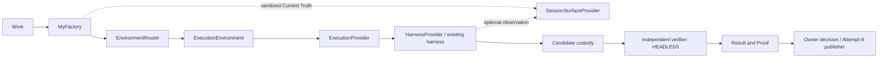

# Optional session surfaces

Status: **PARTIAL — contract implemented; adapters and owner actions DEFERRED.**

This extension is subordinate to the Cloud Execution owner's existing harness → deterministic cloud execution → independent verifier → Mac-off Golden Journey sequence. No surface is required to admit or execute Work. No cloud controller, provider, harness, ledger, queue, custody, verifier or publisher is changed here.

## Ownership and reviewed source

- Environment Fabric owns `@factory/contracts/session-surface` and the capability vocabulary in `@factory/contracts/environment`.
- Cloud Execution owns CLOUD + HEADLESS qualification and any later CLOUD + TMUX adapter. Its independently advanced branch was reviewed at `faf93359a4c54daaf3e0b713a601366db02ba8d6`; no files in its checkout were edited or merged here. Its provider-native image and infrastructure qualification supersedes this branch's historical image blocker. Hosted controller implementation is present; its retained report explicitly leaves canonical Work/harness/verifier/Mac-off/P0 qualification outstanding.
- Fabric owns future OWNER_COMPUTER + CMUX and LOCAL_FACTORY + CMUX/TMUX adapters. Product owns owner-facing Work/Result/Proof presentation; Control Center actions are deferred until attachment is qualified.
- Canonical main rechecked: MyFactory `c0b4c1155a6a98f91375163443938042e6a0be10`, MyEve `d75091eb333a531fa91ed9d39e273948aa9d0eaf`, Relay `a61f0ef697b02cf22da72ff2904c584d7faa026a`. Fabric starting checkpoint `fc8c26f4fb8190d938247a855b2bc7711bf3c677` preserves prior routing and cloud work.
- cmux upstream: [manaflow-ai/cmux at 23d3e8835d9b74bc6859af0e8d5f7ffffe9e27bd](https://github.com/manaflow-ai/cmux/tree/23d3e8835d9b74bc6859af0e8d5f7ffffe9e27bd), project marketing version **0.64.25**. Source reviewed, not an installed/qualified binary. No cmux executable found on PATH.
- tmux: installed CLI reports **3.6a**. Reviewed the matching installed `share/man/man1/tmux.1`, [3.6a manual source](https://github.com/tmux/tmux/blob/3.6a/tmux.1) and [official client/server overview](https://github.com/tmux/tmux/wiki/Getting-Started). No Factory attachment qualified yet.

## Relationship

The diagram describes the extension boundary, not completed production environment routing. HEADLESS means execution proceeds without constructing or calling a surface provider. There is no terminal process supervising the worker. Session existence, closure, crash, disconnect or reconnect never supplies lease, fencing, Work state, verification, publication or spending authority. A provider SDK's existing sandbox `sessionId` is a resource identity; it is not a SessionSurface attachment ID.

## Implemented contract

`packages/contracts/src/session-surface.ts` defines HEADLESS/TMUX/CMUX, an exact canonical execution reference, a strict attachment request, sanitized attention projection, surface-only readback and the narrow provider interface (`observe`, `attach`, `detach`, `reconcile`). There are no start, stop, resume, allocate, execute, verify or publish methods. HEADLESS is deliberately rejected as an interactive attachment request.

The execution reference pins Work and execution generations, Work, execution, environment and attempt. An attachment request contains only that reference and TMUX/CMUX selection. The strict parser rejects unknown fields, host/socket/path/native-session selection, commands, credentials and invalid identities. A provider-private mapping must resolve the actual native session; an opaque attachment ID is not a bearer credential.

`assertSessionAttachmentScope` is a pure identity/scope guard. It requires a current active producer, authenticated operator scope, exact owner/business/reference, explicitly permitted surface, unexpired and unrevoked scope. It denies verifier attachment. It **does not authenticate users or qualify an environment**. Its trusted arguments must come from canonical storage and existing operator authorization, not client or producer JSON. No new authority service, durable grant, registry, HTTP endpoint or adapter is introduced.

## Capability negotiation

The existing versioned descriptor now recognizes `session.headless`, `session.tmux`, `session.cmux`, `session.interactiveAttach`, `session.browser` and `session.notifications`. No adapter advertises them automatically. Availability grants no permission. Unknown versions remain unsupported; old strict readers reject unknown extensions rather than silently accepting them. Do not advertise new capabilities to old peers until their contract version is deployed and negotiated.

For future attachment, require the chosen surface capability AND `session.interactiveAttach`, both advertised at supported version and independently qualified for the exact environment/runtime/provider/policy. Browser and notifications are separately optional. Qualification must bind the actual cmux/tmux version plus adapter/security policy, not merely binary presence. Expiry, offline status, stale heartbeat, protocol mismatch and revocation hide/deny the action. Existing Work/Relay authorization remains mandatory.

None of these six capabilities belongs in productive Work requirements. In particular, absence of `session.headless` does not stop headless execution. Existing cloud routing succeeds without every session capability; surface-only capabilities cannot satisfy repository Work. Tests cover both properties.

## Upstream API crosswalk

Primary sources at the pinned cmux SHA: [CLI compatibility contract](https://github.com/manaflow-ai/cmux/blob/23d3e8835d9b74bc6859af0e8d5f7ffffe9e27bd/docs/cli-contract.md), [local tmux persistence](https://github.com/manaflow-ai/cmux/blob/23d3e8835d9b74bc6859af0e8d5f7ffffe9e27bd/docs/local-tmux.md), [events](https://github.com/manaflow-ai/cmux/blob/23d3e8835d9b74bc6859af0e8d5f7ffffe9e27bd/docs/events.md), `CLI/cmux.swift` SSH-tmux parser and `Sources/SocketControl*` mode definitions. The remote-tmux reconciliation design was reviewed as design, not assumed implemented behavior.

| Opportunity | Decision and boundary |
| --- | --- |
| `new-workspace`, `new-split`, JSON output and stable UUIDs | Adapt for a Work-scoped operator workspace, with repository resolved by Factory. Suggested views: Software Engineer, Tests, Logs, Browser. Never launch the productive harness as a cmux child. Native IDs stay private. |
| `set-status`, `notify`, workspace selection and notification focus | Adapt canonical attention events only; deduplicate by execution/revision/attention. No tool-step notifications and no terminal scraping to determine Work truth. |
| Browser surface API | Defer; allow only the resolved preview, sanitized data and operator's existing scope. Do not import broad browser cookies into Work. |
| Agent hooks, automatic restore/fork and owned-process supervisors | Reject as Factory orchestration or lifecycle authority. Their native process/restore semantics do not establish canonical Work authority. |
| `local-tmux` registry/incarnation checks | Useful reference for stale native-session protection. Its shared user server and lifecycle ownership are not sufficient Work isolation; do not reuse blindly. |
| `ssh-tmux` / `remote.tmux.mirror` | Defer. It mirrors the **whole server**, not one bounded Work session. Never expose a server shared with unrelated Work/owners/verifier material. |
| `mosh-tmux` named-session attachment | Evaluate only after authenticated exact-resource resolution and transport qualification. A session name alone is not isolation. |
| cmux socket modes and `CMUX_SOCKET_PATH` | Use explicit private socket resolution. Do not enable full-open access or let a worker reach the user's broad automation socket. No durable credentials in command arguments/workspace config. |
| tmux `attach-session`, `detach-client`, `-S` socket, explicit target | Adapt as client presentation only. Use a dedicated server/socket/container or equivalent enforced isolation per authorized execution. Read-only client mode limits input, but does not turn an exposed socket into an authorization boundary. |
| tmux environment and lifecycle options | Review `update-environment`, `destroy-unattached`, `exit-unattached`, `exit-empty`; do not inherit control-plane credentials. Productive lifetime must remain independent of all of these settings. |

## Future operator path and security

1. Control Center reads the selected canonical execution and qualified capabilities. Only then offer Open in cmux / Attach with tmux. Neither action exists at this checkpoint.
2. Authenticate the operator; resolve their owner/business and existing Work permissions server-side. Re-read current execution/generations/lease, environment identity, qualification, policy and revocation. Run the identity/scope guard; serialize effect-time fencing with existing authority. A capability advertisement or cached readback cannot skip these checks.
3. Resolve the private attachment mapping automatically. The owner supplies no host, repository path, process ID, native session ID or arbitrary shell command. Revalidate attachment ownership when an opaque attachment ID is supplied; never resolve it globally and disclose another Work.
4. Attach to a bounded observer client. Initial qualification is observation-only: no arbitrary stdin, command injection, sibling pane/server enumeration or credential forwarding. Any later permitted interactive input needs existing explicit tool/Work authorization; attachment itself grants none. Tests panes display admitted check output; they do not independently launch unadmitted checks.
5. Reconnect resolves the same canonical execution and existing native identity/incarnation. Lost or ambiguous surface metadata returns UNAVAILABLE/UNKNOWN; it cannot allocate/restart a worker. Restart reconciles metadata, not productive commands. Detach targets only the authenticated operator's client, never kill-session/kill-server or the worker process group. Expired/revoked access terminates the observer through trusted cleanup without needing the expired user's authority.

Producer/verifier sockets, namespaces, credentials and projections remain separate. Verifiers stay HEADLESS by default. Surface configuration, tmux environment/history, cmux saved layouts and browser state must contain no durable control-plane, signing, Relay, publication or verifier credentials, protected holdouts, or another owner's data. Sanitization and bounded retention apply to displayed logs; raw provider failures are not notifications. Do not scrape screen text to infer success.

Observation must run outside the authoritative execution transaction/worker lifecycle, with bounded queues/timeouts and isolated error handling. A surface failure may update surface availability only. Candidate collection, verification and Result/Proof must proceed independently. The current contract does not yet implement that dispatcher or prove crash continuity.

## Qualification and delivery order

The [qualification report](../environment-fabric/session-surfaces.md) distinguishes contract tests from unrun integration. The [runbook](../runbooks/session-surfaces.md) records the next operator workflow. First complete the cloud owner's HEADLESS Golden Journey without cmux/tmux installed. Then qualify local adapters, crashes/detach/reconnect and security; Cloud Execution may add optional cloud attachment afterward. No paid model call, cloud admission promotion or publication is authorized by this extension.
